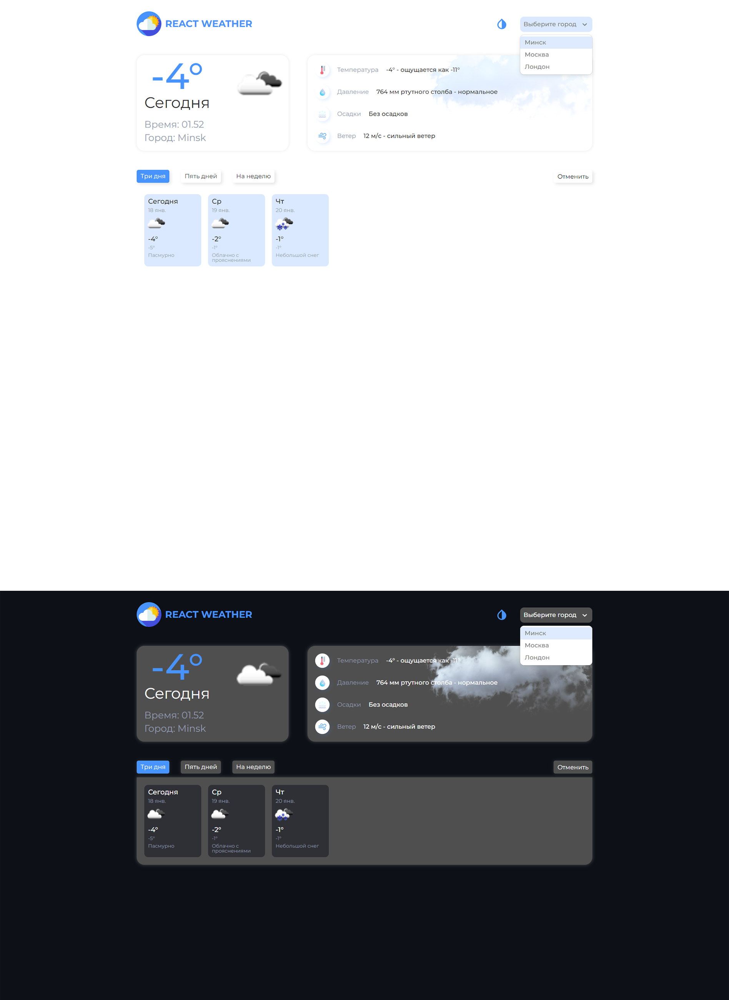

### [Weather - SPA приложение на React и TypeScript.](https://stalise.github.io/React-Weather/)
Приложение предоставляет функционал показа погоды по городам. Данные берутся из API, и обрабатываются для корректного отображения в зависимости от значений. Имеется возможность смены города, выбора количества дней, изменения темы оформления сайта с светлой на темную.     
API - [OpenWeather](https://openweathermap.org/)

##### Стек:
* HTML
* SCSS
* JS
* TS
* React
* Redux

##### Библиотеки и плагины: 
* React-Select
* MomentJs

##### Обзор:  
